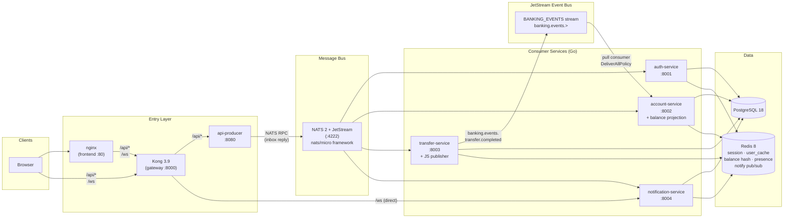

# Microservices Architecture

## Overview



Kong routes **all REST traffic** to `api-producer`, which maps each HTTP path to a specific NATS
action subject (`banking.auth.login`, `banking.account.balance`, etc.), awaits the reply via an
auto-generated inbox subject, and returns the response. Kong routes `/ws` **directly** to
`notification-service` (bypasses the message bus).

---

## Services

### api-producer (port 8080)

Stateless HTTP → NATS RPC proxy. Not a business-logic service — it owns no DB or state.

| Endpoint | Description |
|----------|-------------|
| `*` (all paths under `/api/`) | Forward to the appropriate NATS subject via `subjectFromPath()` |
| `GET /health` | NATS connection check |
| `GET /metrics` | Prometheus metrics |

**Subject routing** ([`producer/handlers.go`](producer/handlers.go)) — exact-match per path:

| HTTP path | NATS subject |
|-----------|-------------|
| `POST /api/auth/register` | `banking.auth.register` |
| `POST /api/auth/login` | `banking.auth.login` |
| `GET /api/account/me` | `banking.account.me` |
| `GET /api/account/balance` | `banking.account.balance` |
| `GET /api/account/lookup` | `banking.account.lookup` |
| `GET /api/account/stats` | `banking.account.stats` |
| `GET /api/account/users` | `banking.account.users` |
| `GET /api/account/transfers` | `banking.account.transfers` |
| `GET /api/account/notifications` | `banking.account.notifications` |
| `GET /api/account/user-detail` | `banking.account.user-detail` |
| `POST /api/transfer/transfer` | `banking.transfer.transfer` |
| `GET /api/notifications/notifications` | `banking.notification.notifications` |

Unknown paths return HTTP 404 immediately — no NATS round-trip.

**RPC message format** (Phase 6b — action is in the subject, not the body):

```json
{ "payload": { "phone": "...", "password": "..." } }
```

Auth headers travel as NATS message headers: `x-session`, `x-admin-secret`. A sampled
`Nats-Trace-Dest` header is added to ~1% of requests for NATS 2.11 server-level tracing.

**Expected reply:**

```json
{ "status": 200, "body": { "...": "any JSON" } }
```

---

### auth-service (port 8001)

Subject prefix: `banking.auth.*`

| Action | Path | Method | Auth | Description |
|--------|------|--------|------|-------------|
| `register` | `/api/auth/register` | `POST` | none | Create user; unique 12-digit account number; bcrypt password |
| `login` | `/api/auth/login` | `POST` | none | Verify credentials; create session token; cache user in Redis |
| `health` | `/api/auth/health` | `GET` | none | DB + Redis readiness |

Password hashing: bcrypt via `golang.org/x/crypto`. Sessions: `session:{sid}` key in Redis (TTL
from `SESSION_TTL_SECONDS`, default 24 h). Login checks Redis user cache by phone or username
first, falls back to DB on miss and populates both `user_cache:phone` and `user_cache:username`
keys.

---

### account-service (port 8002)

Subject prefix: `banking.account.*`

**User actions** (require `x-session`):

| Action | Path | Method | Description |
|--------|------|--------|-------------|
| `me` | `/api/account/me` | `GET` | Authenticated user's profile |
| `balance` | `/api/account/balance` | `GET` | Current balance — Redis hash first, DB fallback with warm-up |
| `lookup` | `/api/account/lookup` | `GET` | Find user by `account_number`, `phone`, or `username` |
| `health` | `/api/account/health` | `GET` | DB + Redis readiness |

**Admin actions** (require `x-session` + `x-admin-secret`):

| Action | Path | Method | Description |
|--------|------|--------|-------------|
| `stats` | `/api/account/stats` | `GET` | User count, transfer count + volume, notification count, total balance |
| `users` | `/api/account/users` | `GET` | Paginated user list; optional `search` (ILIKE across username/phone/account_number) |
| `transfers` | `/api/account/transfers` | `GET` | Paginated transfer list with sender/receiver usernames |
| `notifications` | `/api/account/notifications` | `GET` | Paginated notification list |
| `user-detail` | `/api/account/user-detail` | `GET` | Full profile for a single user by `user_id` |

**Balance read model:** `handleBalance` reads from the Redis `balance` Hash (`HGet O(1)`) written
by `transfer-service`'s post-commit pipeline. On a cache miss it queries PostgreSQL and calls
`SetBalance` to warm the hash for next time.

**JetStream balance projection:** `runBalanceProjection` goroutine consumes `BANKING_EVENTS` stream
with `DeliverAllPolicy` — on cold start or Redis wipe, it replays the full event log and rebuilds
the `balance` hash without touching the DB. Disabled (warn + continue) when NATS has no `-js`.

Auth is enforced by `RequireSession`/`RequireAdmin` middleware at handler registration — handler
bodies are auth-free.

---

### transfer-service (port 8003)

Subject prefix: `banking.transfer.*`

| Action | Path | Method | Auth | Description |
|--------|------|--------|------|-------------|
| `transfer` | `/api/transfer/transfer` | `POST` | session | Atomic balance transfer |
| `health` | `/api/transfer/health` | `GET` | none | DB + Redis readiness |

**Correctness guarantees:**

1. **SERIALIZABLE isolation** — prevents phantom reads during the balance check.
2. **Deterministic lock ordering** — lower user ID locked first via `SELECT FOR UPDATE`; prevents deadlocks on mutual transfers.
3. **Atomic writes** — debit, credit, `transfers` row, and two `notifications` rows in one transaction.
4. **Post-commit Redis pipeline** (Tier 2) — single round-trip: `DEL user_cache:phone:{sender}`, `DEL user_cache:phone:{receiver}`, `HSET balance {senderID} {newBal}`, `HSET balance {receiverID} {newBal}`, `PUBLISH notify:{receiverID}`. Runs after commit — rolled-back transfers never touch Redis.
5. **JetStream publish** (Tier 3) — `banking.events.transfer.completed` with `Nats-Msg-Id: {transferID}` for deduplication. If JetStream is unavailable, logged as WARN; transfer and Redis pipeline still succeed.

Transfer amounts are never logged in plain text — only a 12-char HMAC hex via `logging.MaskAmount`.

---

### notification-service (port 8004)

Subject prefix: `banking.notification.*`. Also runs an HTTP/WebSocket server on the same port.

| Transport | Path | Auth | Description |
|-----------|------|------|-------------|
| NATS | `banking.notification.notifications` | session | Last 50 notifications for the authenticated user |
| HTTP | `GET /health` | none | DB + Redis readiness |
| HTTP | `GET /metrics` | none | Prometheus scrape endpoint |
| WebSocket | `GET /ws?session=<token>` | session (query param) | Real-time push from `notify:{userID}` Redis channel |

The NATS consumer and HTTP/WebSocket server run concurrently under the same `errgroup` root
context. Presence TTL is configured via `PRESENCE_TTL_SECONDS`; the heartbeat interval is derived
as `TTL / 3` — the invariant is self-enforcing. WebSocket fan-out uses Redis pub/sub (not
JetStream) — real-time, low-latency, no replay needed.

---

## Shared internal library (`internal/`)

All consumer services import `banking-demo/internal` (resolved via `go.work` workspace).

| Package | Responsibility |
|---------|---------------|
| `nats/consumer.go` | `Consumer` struct: `nats/micro` service framework, per-action endpoint registration, `RequireSession`/`RequireAdmin` middleware, `WithMetrics` option, `WithConn` for connection sharing, exported `Connect()` helper |
| `nats/jetstream.go` | `InitStream` (idempotent stream creation), `PublishTransferEvent` (with `Nats-Msg-Id` dedup), `NewBalanceConsumer` (durable pull consumer config), subject/consumer name constants |
| `auth` | bcrypt `HashPassword` / `VerifyPassword` |
| `db` | pgx v5 pool, `bob.DB` adapter, typed row structs (`User`, `Transfer`, `Notification`), `IsNotFound`, `IsUniqueViolation`, `SerializableTx` |
| `health` | Shared HTTP + NATS readiness handlers (DB + Redis ping) |
| `logging` | JSON slog factory; `MaskPhone`, `MaskAccount`, `MaskAmount` (HMAC, secret cached via `sync.Once`); `LOG_LEVEL` env var support |
| `metrics` | `ConsumerMetrics` (counter + histogram + reconnect counter); `NewConsumerMetrics(service)` |
| `redis` | `Client` type alias; session CRUD; `GetUserCacheByPhone`/`ByUsername`; `SetUserCache`; `GetBalance`/`SetBalance` (Redis Hash); `PublishTransferCompleted` (4-command pipeline); `SubscribeNotify`; `SetPresence`; `PresenceTTL()` |
| `service` | `InitDeps` (pool + Redis), `Runner` (3-goroutine errgroup lifecycle) |
| `tracing` | OTel OTLP/gRPC provider init; 5-second shutdown timeout baked in |

---

## Kong gateway config

Kong runs in **DB-less** mode in Docker Compose (`kong-compose.yml`), and DB-mode in the k8s HA
setup (`kong-ha/`).

| Service | Upstream | Routes |
|---------|----------|--------|
| `api-producer` | `http://api-producer:8080` | `/api` (strip_path: false) |
| `notification-service` | `http://notification-service:8004` | `/ws` (http + https) |

CORS plugin attached to both services; origins configurable via `global.corsOrigins` in Helm values.

---

## Database schema

All services share one PostgreSQL database (`banking`). Schema is managed by `golang-migrate` SQL
files in [`migrations/`](migrations/).

| Table | Key columns | Notes |
|-------|-------------|-------|
| `users` | `id`, `phone` (unique), `account_number` (unique), `username`, `password_hash`, `balance` (INTEGER, default 100000), `is_admin` | Indexed on `phone`, `account_number`, `username` |
| `transfers` | `id`, `from_user` → `users.id`, `to_user` → `users.id`, `amount`, `created_at` | |
| `notifications` | `id`, `user_id` → `users.id`, `message`, `is_read`, `created_at` | Indexed on `user_id` |

---

## Redis key space

| Key pattern | Type | TTL | Writer | Reader | Purpose |
|-------------|------|-----|--------|--------|---------|
| `session:{sid}` | String | `SESSION_TTL_SECONDS` (24 h) | auth-service | all services | Session token → user ID |
| `user_cache:phone:{phone}` | String | `USER_CACHE_TTL_SECONDS` (5 min) | auth-service | auth-service | Login fast-path; DEL'd post-transfer commit |
| `user_cache:username:{username}` | String | `USER_CACHE_TTL_SECONDS` (5 min) | auth-service | auth-service | Login fast-path; DEL'd post-transfer commit |
| `balance` | Hash | no TTL | transfer-service (HSET) · account-service (warm-up) | account-service | Balance read model; field = userID string |
| `presence:{userID}` | String | `PRESENCE_TTL_SECONDS` (60 s) | notification-service | — | Online status; refreshed by WS heartbeat |
| `notify:{userID}` | pub/sub channel | — (ephemeral) | transfer-service | notification-service | Real-time transfer events |

`notify:{userID}` carries `TransferCompleted` JSON
(`{"transfer_id":N,"amount":N,"sender_id":N,"sender_balance":N,"receiver_id":N,"receiver_balance":N}`),
published after transaction commit.

---

## JetStream streams and consumers

| Stream | Subjects | Retention | Replicas | Dedup window |
|--------|----------|-----------|----------|-------------|
| `BANKING_EVENTS` | `banking.events.>` | `LimitsPolicy` (30 days) | 1 | 5 minutes |

| Consumer | Stream | Filter | Durable | Deliver policy | AckPolicy | MaxAckPending |
|----------|--------|--------|---------|---------------|-----------|---------------|
| `account-service-balance` | `BANKING_EVENTS` | `banking.events.transfer.completed` | yes | `DeliverAll` (replay on cold start) | Explicit | 100 |
