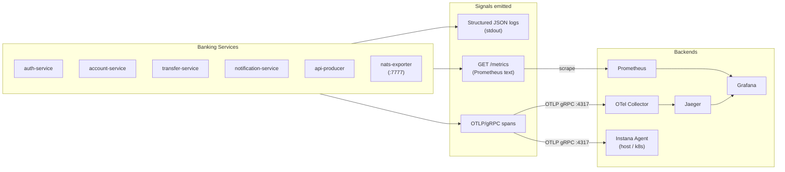

# Observability

The banking demo is instrumented with three complementary pillars: **structured logs**, **Prometheus metrics**, and **OpenTelemetry distributed tracing**. For production Kubernetes deployments, Instana is the primary backend; the `monitoring/` manifests provide a self-hosted Prometheus + Grafana + Jaeger alternative.

## Architecture



`nats-exporter` (`natsio/prometheus-nats-exporter:0.20.1`) scrapes the NATS HTTP monitoring port (`:8222`) and exposes `/varz`, `/connz`, `/subsz` metrics at `:7777` for Prometheus.

---

## Instrumentation

All instrumentation is written in Go and lives in the `internal/` shared library. Each service wires it at startup — no per-service boilerplate.

**Consumer services** — instrumented via `internal/metrics.ConsumerMetrics`:
- Every NATS message processed → `nats_messages_total{service, action, status}` counter
- Handler execution time → `nats_handler_duration_seconds{service, action}` histogram
- NATS reconnect events → `nats_reconnects_total{service}` counter

**api-producer** — instrumented via `producer/metrics.go`:
- Every HTTP request → `http_requests_total{method, route, status}` counter
- HTTP latency → `http_request_duration_seconds{method, route}` histogram
- Each NATS RPC call → `rpc_requests_total{subject, status}` counter
- RPC round-trip → `rpc_roundtrip_duration_seconds{subject}` histogram
- NATS connection state → `nats_connected` gauge

**Structured JSON logs** — `log/slog` on every service:

Every log line includes `"service"` and, when tracing is active, can be correlated to spans via `trace_id`.

```json
{
  "time": "2026-07-03T10:00:00Z",
  "level": "INFO",
  "msg": "transfer_success",
  "service": "transfer-service",
  "transfer_id": 42,
  "sender_id": 1,
  "receiver_id": 7,
  "amount": "a3f1c9d2b4e8"
}
```

---

## Metrics reference

### Consumer services (`auth`, `account`, `transfer`, `notification`)

| Metric | Type | Labels | Description |
|--------|------|--------|-------------|
| `nats_messages_total` | Counter | `service`, `action`, `status` | Total NATS messages processed |
| `nats_handler_duration_seconds` | Histogram | `service`, `action` | Handler execution latency |
| `nats_reconnects_total` | Counter | `service` | NATS reconnect events |

### api-producer

| Metric | Type | Labels | Description |
|--------|------|--------|-------------|
| `http_requests_total` | Counter | `method`, `route`, `status` | Total HTTP requests |
| `http_request_duration_seconds` | Histogram | `method`, `route` | HTTP request latency |
| `rpc_requests_total` | Counter | `subject`, `status` | Total NATS RPC calls dispatched |
| `rpc_roundtrip_duration_seconds` | Histogram | `subject` | End-to-end NATS RPC latency |
| `rpc_inflight_requests` | Gauge | — | Currently in-flight RPC calls |
| `rpc_timeouts_total` | Counter | — | RPC calls that exceeded response timeout |
| `rpc_publish_errors_total` | Counter | — | Publish or no-responders failures |
| `nats_connected` | Gauge | — | `1` = connected, `0` = disconnected |

### NATS server (`nats-exporter` sidecar)

| Metric | Description |
|--------|-------------|
| `gnatsd_varz_connections` | Current client connections |
| `gnatsd_varz_in_msgs` / `out_msgs` | Message throughput |
| `gnatsd_connz_*` | Per-connection statistics |
| `gnatsd_subsz_num_subscriptions` | Active subscriptions |

### NATS micro service stats

Each consumer service registers itself with `nats/micro`. Use the NATS CLI to inspect
per-action counters and latency without touching Prometheus:

```bash
# List all registered micro services
nats micro ls

# Per-action request counts, error counts, and average latency for a service
nats micro stats account-service
nats micro stats transfer-service
nats micro stats auth-service
nats micro stats notification-service
```

`nats micro stats <name>` output example:

```
╭──────────────────────────────────────────────────────────────╮
│              Service Statistics: account-service             │
├───────────────────────┬──────────┬──────────┬───────────────╮
│ Endpoint              │ Requests │ Errors   │ Avg Latency   │
├───────────────────────┼──────────┼──────────┼───────────────┤
│ banking.account.me    │    4 231 │        0 │        1.2 ms │
│ banking.account.balance│   8 192 │        0 │        0.8 ms │
│ banking.account.lookup│     318 │        1 │        1.4 ms │
╰───────────────────────┴──────────┴──────────┴───────────────╯
```

### JetStream — balance projection consumer lag

The `account-service-balance` durable pull consumer on the `BANKING_EVENTS` stream
can fall behind during a Redis outage. Monitor lag with:

```bash
# Consumer info — shows NumPending (unprocessed messages)
nats consumer info BANKING_EVENTS account-service-balance

# Stream overview — all consumers and their pending counts
nats stream info BANKING_EVENTS
```

Key fields to alert on:

| Field | Meaning | Alert threshold |
|-------|---------|-----------------|
| `NumPending` | Messages not yet ACKed by the consumer | > 1 000 |
| `NumRedelivered` | Delivery retries (indicates processing errors) | > 10 |
| `NumWaiting` | Fetch calls waiting for messages | informational |

### Nats-Trace-Dest — sampled RPC tracing

The `api-producer` injects a `Nats-Trace-Dest` header on 1 % of NATS requests
(configurable via `NATS_TRACE_SAMPLE_RATE` env var, default `0.01`).
When the connected NATS server is ≥ 2.11, broker-level message traces are published to:

```
banking.trace.rpc.<action-subject>
```

For example, a sampled `banking.account.balance` request publishes its trace to
`banking.trace.rpc.banking.account.balance`. Subscribe with:

```bash
nats sub 'banking.trace.rpc.>'
```

On NATS < 2.11 the header is forwarded but the server ignores it — no messages are
published and there is no performance cost.

---

## Kubernetes — self-hosted stack (`monitoring/`)

### Deploy

```bash
# Deploy banking app first (namespace banking must exist)
helm upgrade --install banking-demo ./helm --namespace banking --create-namespace

# Then apply the monitoring stack
kubectl apply -f monitoring/
```

Apply order within `monitoring/` is handled by namespace → infra → Grafana ordering in the manifests; a single `kubectl apply -f monitoring/` is sufficient.

### Manifests

| File | Description |
|------|-------------|
| `monitoring/namespace.yaml` | `monitoring` namespace |
| `monitoring/prometheus-configmap.yaml` | Scrape config for all `banking` namespace pods |
| `monitoring/prometheus.yaml` | Prometheus Deployment + Service |
| `monitoring/otel-collector-config.yaml` | OTel Collector pipeline: OTLP receiver → Jaeger exporter |
| `monitoring/otel-collector.yaml` | OTel Collector Deployment + Service |
| `monitoring/jaeger.yaml` | Jaeger all-in-one (OTLP ingest, trace storage, UI) |
| `monitoring/grafana-datasources.yaml` | Prometheus + Jaeger datasources |
| `monitoring/grafana-dashboard-provider.yaml` | Dashboard auto-provisioning |
| `monitoring/grafana-dashboard-banking.yaml` | Pre-built Banking Services dashboard |
| `monitoring/grafana.yaml` | Grafana Deployment + Service |
| `monitoring/ingress.yaml` | Ingress for Grafana, Jaeger, Prometheus |

### Access

Add to `/etc/hosts` (replace `<INGRESS_IP>` with `kubectl get ingress -n monitoring -o jsonpath='{.items[0].status.loadBalancer.ingress[0].ip}'`):

```
<INGRESS_IP>  grafana.banking.local jaeger.banking.local prometheus.banking.local
```

| UI | URL | Credentials |
|----|-----|-------------|
| Grafana | http://grafana.banking.local | `admin` / `admin` |
| Prometheus | http://prometheus.banking.local | — |
| Jaeger | http://jaeger.banking.local | — |

Or use port-forward without Ingress:

```bash
kubectl -n monitoring port-forward svc/grafana     3000:3000
kubectl -n monitoring port-forward svc/prometheus  9090:9090
kubectl -n monitoring port-forward svc/jaeger      16686:16686
```

### Enable tracing on services

Set `OTEL_EXPORTER_OTLP_ENDPOINT` on every service to point at the OTel Collector:

```bash
helm upgrade banking-demo ./helm -n banking --reuse-values \
  --set 'global.env.OTEL_EXPORTER_OTLP_ENDPOINT=http://otel-collector.monitoring.svc.cluster.local:4317'
```

To disable tracing, remove the variable (metrics continue to work regardless).

---

## Instana

See [`instana/docs/`](instana/docs/README.md) for the complete runbook series. Quick reference:

### Agent configuration

| File | Target environment |
|------|--------------------|
| [`instana/configuration.yaml`](instana/configuration.yaml) | Active config (k8s) |
| [`instana/configuration-k8s.yaml`](instana/configuration-k8s.yaml) | Kubernetes (k3s / EC2) |
| [`instana/configuration-docker-compose.yaml`](instana/configuration-docker-compose.yaml) | Docker Compose / local |

### Wire OTel to Instana agent

```bash
helm upgrade banking-demo ./helm -n banking --reuse-values \
  --set 'global.env.OTEL_EXPORTER_OTLP_ENDPOINT=http://instana-agent.instana-agent.svc.cluster.local:4317' \
  --set 'global.env.OTEL_SERVICE_NAME=banking-demo'
```

The Instana host agent listens for OTLP/gRPC on port 4317 when `com.instana.plugin.opentelemetry.grpc.enabled: true` is set in `configuration.yaml`.

### Synthetic monitoring

Four test scripts in [`instana/synthetic/`](instana/synthetic/README.md):

| Script | What it tests |
|--------|---------------|
| `health-checks.js` | All service `/health` endpoints |
| `user-login-flow.js` | Register → login → `/me` round-trip |
| `transfer-flow.js` | Login → initiate transfer → assert completion |
| `auth-edge-cases.js` | Wrong password, expired token, missing header → correct 4xx |

---

## Useful queries

### Prometheus

```promql
# Request rate per service (5-minute window)
rate(nats_messages_total[5m])

# 99th percentile handler latency by service
histogram_quantile(0.99, rate(nats_handler_duration_seconds_bucket[5m]))

# RPC error rate at producer (5xx from consumers)
rate(rpc_requests_total{status=~"5.."}[5m])

# NATS reconnect events (should be near zero in steady state)
increase(nats_reconnects_total[1h])

# API-producer HTTP error rate
rate(http_requests_total{status=~"5.."}[5m])
```

### kubectl log filtering

```bash
# Trace a full RPC round-trip by subject
kubectl logs -n banking -l app=api-producer -f \
  | grep '"msg":"nats_request"'

# Follow errors across all services
kubectl logs -n banking --all-containers=true -f \
  | grep '"level":"ERROR"'

# Watch transfer completions
kubectl logs -n banking -l app=transfer-service -f \
  | grep '"msg":"transfer_success"'

# Watch NATS reconnect events across all consumers
kubectl logs -n banking --all-containers=true -f \
  | grep '"msg":"nats_reconnected"'
```
