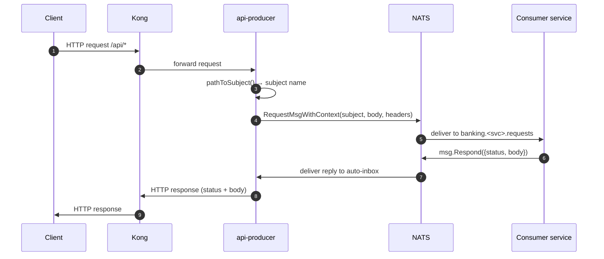
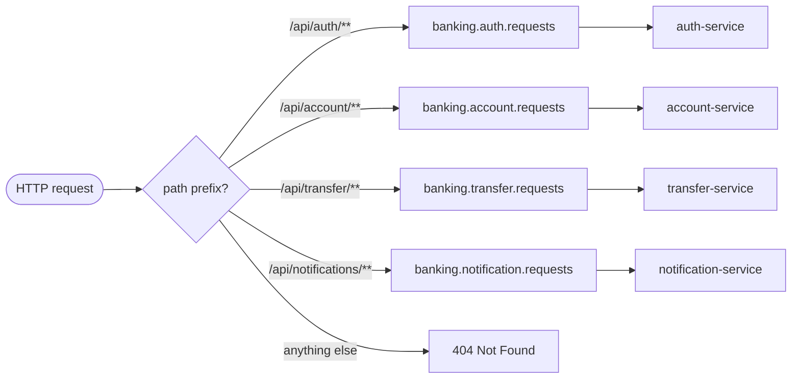

# api-producer

HTTP gateway that receives requests from Kong, maps them to a NATS subject, and returns the consumer's response synchronously using NATS request/reply.

## How it works



1. An HTTP request arrives on any `/api/*` path.
2. [`pathToSubject()`](handlers.go) maps the path prefix to a NATS subject (`banking.auth.requests`, etc.).
3. [`rpcClient.call()`](rpc.go) calls `nc.RequestMsgWithContext` — NATS sets a temporary inbox reply subject and delivers the reply directly to the waiting goroutine. No correlation IDs or reply queues to manage.
4. The consumer service processes the message and calls `msg.Respond(data)`.
5. `call()` returns the decoded `rpcResponse`; its `status` + `body` are returned to the HTTP caller as-is.

## Path → Subject routing



## RPC message format

**Published as NATS message body:**
```json
{
  "action": "register",
  "path": "/api/auth/register",
  "method": "POST",
  "payload": { "...": "request body or query params" },
  "headers": {
    "x-session": "...",
    "x-admin-secret": "..."
  }
}
```

`x-session` and `x-admin-secret` are also forwarded as NATS message headers so consumers can read them without parsing the JSON body.

**Expected reply:**
```json
{
  "status": 200,
  "body": { "...": "any JSON" }
}
```

The HTTP response status code and body are taken directly from the reply.

## Endpoints

| Method | Path       | Description                                            |
|--------|------------|--------------------------------------------------------|
| `GET`  | `/health`  | Returns `200` when NATS is connected, `503` otherwise  |
| `GET`  | `/metrics` | Prometheus metrics                                     |
| `*`    | `/*`       | Proxy to NATS (routes described above)                 |

## Configuration

All configuration is via environment variables.

| Variable                        | Default                     | Description                                        |
|---------------------------------|-----------------------------|----------------------------------------------------|
| `PORT`                          | `8080`                      | HTTP listen port                                   |
| `NATS_URL`                      | `nats://nats:4222`          | NATS connection URL                                |
| `NATS_RESPONSE_TIMEOUT`         | `60s`                       | Max wait for a consumer reply (Go duration string) |
| `CORS_ORIGINS`                  | `http://localhost:3000,...` | Comma-separated list of allowed CORS origins       |
| `OTEL_EXPORTER_OTLP_ENDPOINT`   | _(empty — tracing disabled)_| OTLP/gRPC endpoint e.g. `http://otel-collector:4317` |

## Running locally

**Prerequisites:** Go 1.26+, a running NATS server.

```bash
# start a local NATS server (Docker)
docker run -d --name nats -p 4222:4222 nats:2-alpine

# from the repo root
cd producer
go mod download
NATS_URL=nats://localhost:4222 go run .
```

## Building

```bash
cd producer
go build -o api-producer .
./api-producer
```

## Docker

The Dockerfile is at [`producer/Dockerfile`](Dockerfile) and is called from the repo root (it copies from `producer/`):

```bash
# from the repo root
docker build -f producer/Dockerfile -t api-producer .
```

The image is a two-stage build: Go compiler on `golang:1.26-alpine`, final image on `alpine:3.23` with `ca-certificates` and `curl` only. The binary runs as the default non-root Alpine user.

## Observability

### Logs

Structured JSON to stdout via `log/slog`. Every line carries `"service": "api-producer"`.

```json
{"time":"2025-01-01T00:00:00Z","level":"INFO","msg":"http_server_started","service":"api-producer","addr":":8080"}
{"time":"2025-01-01T00:00:00Z","level":"INFO","msg":"nats_reconnected","service":"api-producer","url":"nats://nats:4222"}
{"time":"2025-01-01T00:00:00Z","level":"ERROR","msg":"nats_disconnected","service":"api-producer","error":"..."}
```

### Prometheus metrics

Exposed at `/metrics`.

| Metric | Type | Labels | Description |
|--------|------|--------|-------------|
| `http_requests_total` | Counter | `method`, `route`, `status` | Total HTTP requests |
| `http_request_duration_seconds` | Histogram | `method`, `route` | HTTP request latency |
| `rpc_requests_total` | Counter | `subject`, `status` | Total NATS RPC calls dispatched |
| `rpc_roundtrip_duration_seconds` | Histogram | `subject` | End-to-end NATS RPC latency (including consumer processing) |
| `rpc_inflight_requests` | Gauge | — | Current in-flight RPC calls |
| `rpc_timeouts_total` | Counter | — | RPC calls that exceeded `NATS_RESPONSE_TIMEOUT` |
| `rpc_publish_errors_total` | Counter | — | Publish failures or no-responders (`ErrNoResponders` → HTTP 503) |
| `nats_connected` | Gauge | — | `1` = connected, `0` = disconnected |

### Tracing

OpenTelemetry traces are exported via OTLP/gRPC when `OTEL_EXPORTER_OTLP_ENDPOINT` is set. Each RPC call produces a `rpc.request` span with `messaging.system=nats`, `messaging.destination.name=<subject>`, and `rpc.duration_ms` attributes.

## File layout

```
producer/
├── main.go       — config, server wiring, graceful shutdown
├── rpc.go        — rpcClient: NATS connection, RequestMsgWithContext, OTel spans
├── handlers.go   — HTTP handlers, pathToSubject() routing, JSON helpers
├── metrics.go    — Prometheus metrics struct and registration
├── tracing.go    — OpenTelemetry provider setup
├── Dockerfile
├── go.mod
└── go.sum
```

## Reliability notes

- **Auto-reconnect** — `MaxReconnects(-1)` + `RetryOnFailedConnect(true)` means the service never gives up. Reconnect jitter (500 ms – 2 s) prevents thundering-herd on mass restart.
- **No-responders** — if a consumer service has no running instances, NATS returns `ErrNoResponders` immediately; the producer maps this to HTTP `503` rather than hanging until timeout.
- **Ping keepalive** — `PingInterval(20s)` with `MaxPingsOutstanding(5)` detects silent TCP hangs within ~100 s.
- **Graceful shutdown** — on `SIGINT`/`SIGTERM`, the HTTP server drains in-flight HTTP requests (10 s window) then `nc.Drain()` flushes pending outbound messages before the process exits.
- **Server timeouts** — `ReadHeaderTimeout: 10s`, `WriteTimeout: ResponseTimeout + 15s` to prevent slow-client resource exhaustion.
